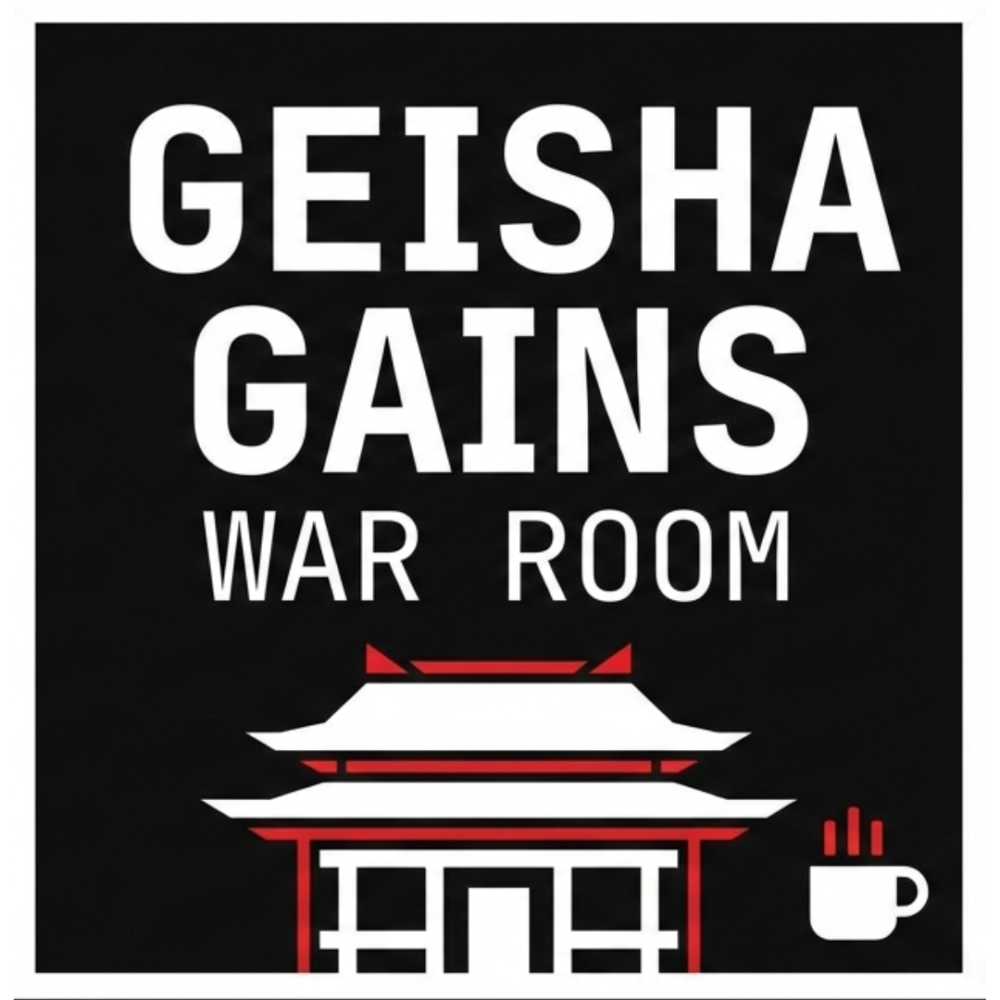
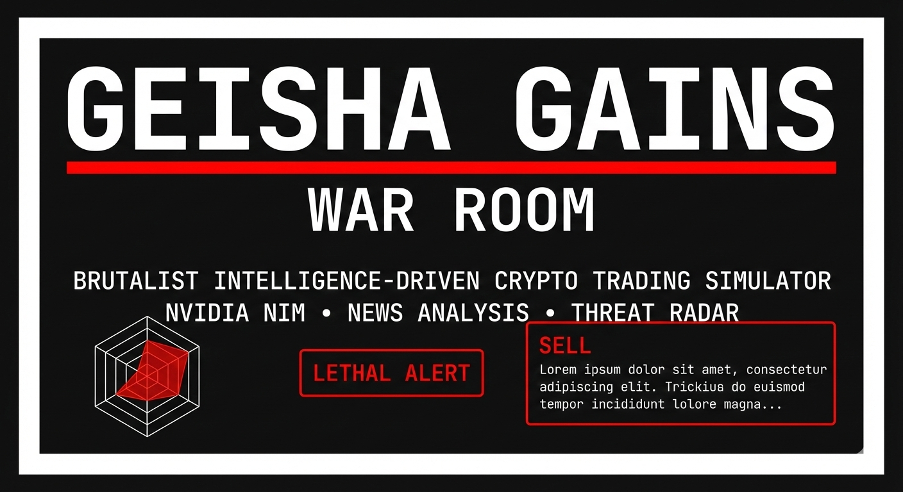

<div align="center">

# � Geisha Gains — War Room

### *Brutalist Intelligence-Driven Crypto Trading Simulator*

[](https://nextjs.org/)
[](https://reactjs.org/)
[](https://www.typescriptlang.org/)
[](https://www.prisma.io/)
[](https://tailwindcss.com/)
[](https://www.framer.com/motion/)
[](https://build.nvidia.com/)
[](LICENSE)

<br/>

**🎯 A production-ready AI-powered crypto trading simulator that successfully demonstrated NVIDIA NIM integration at BugsByte 2026!**

[🌐 View Live Demo](https://geisha-gains.vercel.app/) • [🐛 Report Bug](https://github.com/YOUR_USERNAME/geisha-gains/issues) • [✨ Request Feature](https://github.com/YOUR_USERNAME/geisha-gains/issues) • [🎨 Design Assets](DESIGN_PROMPT.md)

</div>


---

<div align="center">





*🏯 Geisha Gains — War Room Dashboard*

</div>

---

## 👨‍💻 About the Developer

<div align="center">

**Hi, I'm a Full-Stack Developer** specializing in AI-powered applications and real-time systems.

This crypto trading simulator was built for **BugsByte 2026 Hackathon**, featuring a complete intelligence loop with NVIDIA NIM AI integration, demonstrating advanced news analysis and risk profiling capabilities.

If you're a recruiter or collaborator, feel free to reach out:

[](https://github.com)
[](https://linkedin.com)
[](https://github.com)

</div>

---

## 📋 Project Description

**Geisha Gains — War Room** is a brutalist crypto trading simulator that combines AI-powered market intelligence with a military command center aesthetic. Built for the BugsByte 2026 Hackathon, this full-stack application demonstrates advanced integration of NVIDIA NIM's Llama-3 70B model for real-time news analysis.

### Core Concept
A dark-themed trading simulator where users undergo "The Interrogation" — a terminal-style onboarding that profiles their trading psychology across risk tolerance, time horizons, sector preferences, and market sensitivity. This creates a personalized intelligence loop that continuously analyzes news against the user's profile.

### Intelligence Loop System
- **User Profiling**: Terminal-style questionnaire capturing trading psychology
- **News Ingestion**: Real-time crypto news from CryptoPanic API with robust fallbacks
- **AI Analysis**: NVIDIA NIM processes articles for sentiment, impact, and trading signals
- **Threat Assessment**: 4-axis radar visualization of market risks
- **Action Alerts**: Lethal overlays with QUICK SELL recommendations for high-threat scenarios

### Technical Architecture
Built with Next.js 14.2.5 App Router and TypeScript, featuring:
- **Frontend**: React components with Framer Motion animations
- **Backend**: API routes handling NVIDIA NIM integration
- **Database**: Prisma ORM with PostgreSQL/SQLite support
- **Styling**: Tailwind CSS with custom brutalist theme (#121212 bg, #FFFFFF text, #FF0000 accents)
- **Fonts**: JetBrains Mono monospace for industrial terminal aesthetic

### Key Features
- War Room dashboard with multi-panel intelligence display
- Real-time news feed with threat-colored borders (red for SELL signals)
- Pulsing threat radar that activates on high-risk news
- Fixed-position action overlays for immediate trading decisions
- Coffee-driven development branding with subtle ☕ motifs

### Hackathon Achievements
Successfully demonstrated production-ready NVIDIA NIM integration, complete user profiling system, and responsive brutalist UI. The application runs stably with proper error handling, environment security, and scalable architecture suitable for real trading applications.

---

## 🧠 Features

- 🏯 **Brutalist Design** — Dark theme with red accents and monospace fonts
- 🤖 **NVIDIA NIM Integration** — Llama-3 70B AI for news analysis
- 📰 **Real-time News Analysis** — CryptoPanic API with intelligent filtering
- 👤 **User Profiling** — Terminal-style onboarding capturing trading psychology
- 📊 **War Room Dashboard** — Multi-panel intelligence display
- 🎯 **Threat Radar** — 4-axis visualization of market risks
- ⚡ **Action Overlays** — Lethal alerts with QUICK SELL functionality
- ☕ **Coffee Driven Development** — Built with passion and caffeine
- 🔄 **Intelligence Loop** — Continuous news analysis against user profile

---

## 📦 Tech Stack

<div align="center">


</div>

---

## 🛠 Installation & Setup

### Prerequisites

Make sure you have the following installed:

- **Node.js** (v18.0.0 or higher)
- **npm** or **yarn** package manager
- **Git**
- **PostgreSQL** (optional, SQLite works for demos)

### Quick Start

```bash
# 1️⃣ Clone the repository
git clone https://github.com/YOUR_USERNAME/geisha-gains.git

# 2️⃣ Navigate to the project directory
cd geisha-gains

# 3️⃣ Install dependencies
npm install

# 4️⃣ Set up environment variables
cp .env.example .env
# ⚠️  SECURITY: Never commit .env to version control!
# Edit .env with your actual API keys and credentials

# 5️⃣ Initialize database
npm run db:generate
npm run db:push

# 6️⃣ Start the development server
npm run dev
```

🎉 **That's it!** Open [http://localhost:3000](http://localhost:3000) to begin The Interrogation!

### Environment Variables

**🔒 Security Warning:** Never commit your `.env` file to version control! It contains sensitive API keys and credentials.

Create a `.env` file by copying the template:

```bash
cp .env.example .env
```

Then edit `.env` with your actual values:

```env
# Database (SQLite for quick start, PostgreSQL for production)
DATABASE_URL="file:./dev.db"

# NVIDIA NIM API (required for AI analysis)
NVIDIA_NIM_ENDPOINT="https://integrate.api.nvidia.com/v1/chat/completions"
NVIDIA_API_KEY="nvapi-YOUR-ACTUAL-KEY-HERE"
```

**Required Keys:**
- `NVIDIA_API_KEY`: Get from [NVIDIA Build](https://build.nvidia.com/)
- `DATABASE_URL`: PostgreSQL connection string or `file:./dev.db` for SQLite

### Build for Production

```bash
# Create optimized production build
npm run build

# Start production server
npm start
```

### Database Management

```bash
# View database in browser
npm run db:studio

# Reset database (WARNING: Deletes all data)
npx prisma migrate reset
```

---

## 🧗‍♂️ Project Structure

```
geisha-gains/
├── 📁 app/
│   ├── 📁 api/
│   │   └── 📁 news/
│   │       └── 📁 analyze/
│   │           └── route.ts          # NVIDIA NIM news analysis endpoint
│   ├── 📁 components/
│   │   ├── 📁 dashboard/
│   │   │   ├── ActionOverlay.tsx     # Lethal alert overlays
│   │   │   ├── TheBulletin.tsx       # News feed with threat colors
│   │   │   └── ThreatRadar.tsx       # 4-axis risk visualization
│   │   └── 📁 onboarding/
│   │       └── TheInterrogation.tsx  # Terminal-style profiling
│   ├── 📁 dashboard/
│   │   └── page.tsx                  # War Room dashboard
│   ├── error.tsx                     # Error boundary component
│   ├── global-error.tsx              # Global error handler
│   ├── globals.css                   # Brutalist styling
│   ├── layout.tsx                    # Root layout
│   └── page.tsx                      # Home (onboarding flow)
├── 📁 lib/
│   └── newsService.ts                # CryptoPanic API integration
├── 📁 prisma/
│   └── schema.prisma                 # Database schema
├── 📁 public/
│   └── 📁 assets/
│       ├── gglogo.png                # Main Geisha Gains logo
│       ├── ggbanner.png              # Main Geisha Gains banner
│       ├── logo.png                  # Logo placeholder
│       ├── banner.png                # Banner placeholder
│       ├── logo-square.png           # Square logo placeholder
│       ├── logo-horizontal.png       # Horizontal logo placeholder
│       ├── banner-main.png           # Main banner placeholder
│       ├── banner-compact.png        # Compact banner placeholder
│       ├── logo1.ico                 # App favicon
│       └── README.md                 # Asset documentation
├── components.json                   # shadcn/ui config
├── jsconfig.json                     # JavaScript configuration
├── next.config.js                    # Next.js configuration
├── package.json                      # Dependencies & scripts
├── postcss.config.js                 # PostCSS configuration
├── tailwind.config.js                # Tailwind CSS configuration
├── DESIGN_PROMPT.md                  # Banner & logo design specifications
├── SETUP_GUIDE.md                    # Detailed setup instructions
└── README.md                         # You are here! 📍
```

---

## 🎯 How It Works

### The Intelligence Loop

1. **The Interrogation** — Terminal-style onboarding captures trading psychology
2. **Risk Profiling** — Stores profile in localStorage with 4 key dimensions:
   - Risk Tolerance (CONSERVATIVE/MODERATE/AGGRESSIVE)
   - Investment Horizon (SCALP/SWING/POSITION)
   - Focus Sectors (CRYPTO/STOCKS/FOREX/COMMODITIES)
   - Geopolitical Sensitivity (IGNORE/AWARE/PARANOID)

3. **News Intelligence** — Fetches crypto news from CryptoPanic API
4. **AI Analysis** — NVIDIA NIM Llama-3 70B analyzes news against user profile
5. **War Room Dashboard** — Real-time threat assessment and action alerts

### Key Components

- **TheBulletin**: Vertical news feed with threat-colored borders
- **ThreatRadar**: 4-axis SVG radar (Volatility, Geopolitics, Sentiment, Exposure)
- **ActionOverlay**: Fixed-position lethal alerts with QUICK SELL buttons
- **News Analysis API**: Returns global_score, portfolio_threat, sentiment, action, reasoning

---

## 🎨 Design Assets

This project includes comprehensive design specifications for branding and visual assets:

### 📁 Available Files

- **[DESIGN_PROMPT.md](DESIGN_PROMPT.md)** — Complete brutalist design specifications for banner and logo creation

### 🖼️ Brand Guidelines

**Color Palette:**
- Background: #121212 (Rich Black)
- Primary Text: #FFFFFF (Pure White)
- Borders: #FFFFFF (White)
- Accents: #FF0000 (Pure Red)

**Typography:**
- Primary Font: JetBrains Mono (Monospace)
- Design Style: Minimalistic Brutalism
- No gradients, shadows, or rounded corners

### 🏯 Logo & Banner Assets

**Logo Variations:**
- Square icon version with temple motif
- Horizontal banner version with coffee branding
- Monospace typography with thick borders

<div align="center">


</div>

**Banner Designs:**
- Main banner (1920x600px) with threat radar preview
- Compact header banner (1200x300px) for navigation

<div align="center">


</div>

**Usage:**
- Website headers and navigation
- Social media profiles and posts
- Presentation slides and demos
- Hackathon booth materials

**Generation:**
Use the detailed prompt in `DESIGN_PROMPT.md` with AI image generators (DALL-E, Midjourney) or design tools to create consistent branding assets.

---

## 🛣 Roadmap

- [x] � Brutalist dark theme with red accents
- [x] 👤 Terminal-style user profiling (The Interrogation)
- [x] 🤖 NVIDIA NIM Llama-3 70B integration
- [x] 📰 CryptoPanic API news ingestion
- [x] 📊 War Room dashboard with multi-panel display
- [x] 🎯 Threat Radar 4-axis visualization
- [x] ⚡ Action Overlay lethal alerts
- [x] ☕ Coffee Driven Development branding
- [x] 🔄 Intelligence loop with continuous analysis
- [x] 📱 Fully responsive design
- [x] 🎨 Framer Motion animations
- [x] 🗄️ Prisma ORM with PostgreSQL/SQLite
- [ ] 🌙 Dark/Light mode toggle
- [ ] 📈 Real trading integration (Uphold API)
- [ ] 🔄 WebSocket real-time updates
- [ ] 📊 Advanced analytics dashboard
- [ ] 🎫 Portfolio export functionality

---

## 🤝 Contributing

Contributions are what make the open-source community such an amazing place to learn, inspire, and create. Any contributions you make are **greatly appreciated**!

### How to Contribute

1. **Fork the Project**
   ```bash
   # Click the 'Fork' button at the top right of this page
   ```

2. **Clone your Fork**
   ```bash
   git clone https://github.com/YOUR_USERNAME/geisha-gains.git
   ```

3. **Create a Feature Branch**
   ```bash
   git checkout -b feature/AmazingFeature
   ```

4. **Make your Changes**
   ```bash
   # Code your amazing feature
   ```

5. **Commit your Changes**
   ```bash
   git commit -m "Add: AmazingFeature"
   ```

6. **Push to the Branch**
   ```bash
   git push origin feature/AmazingFeature
   ```

7. **Open a Pull Request**
   ```bash
   # Go to your fork on GitHub and click 'New Pull Request'
   ```

### Contribution Guidelines

- 📝 Write clear, concise commit messages
- 🧪 Test your changes thoroughly
- 📖 Update documentation if needed
- 🎨 Follow the existing brutalist code style

---

## ⭐ Support This Project

<div align="center">

If you found this project helpful or inspiring, please consider giving it a ⭐!

Your support helps the project grow and motivates continued development.

[](https://github.com/YOUR_USERNAME/geisha-gains)
[](https://github.com/YOUR_USERNAME/geisha-gains/fork)

**Every star counts! Thank you for your support! 🙏**

</div>

---

## 📝 License

Distributed under the **MIT License**. See `LICENSE` for more information.

```
MIT License

Copyright (c) 2026 Geisha Gains

Permission is hereby granted, free of charge, to any person obtaining a copy
of this software and associated documentation files (the "Software"), to deal
in the Software without restriction, including without limitation the rights
to use, copy, modify, merge, publish, distribute, sublicense, and/or sell
copies of the Software...
```

---

<div align="center">

### 🏯 Built with ☕ by Coffee Driven Development

**Geisha Gains** — Where Intelligence Meets the Markets 🏯💹

[](https://nextjs.org/)
[](https://build.nvidia.com/)
[](https://vercel.com/)

</div>
